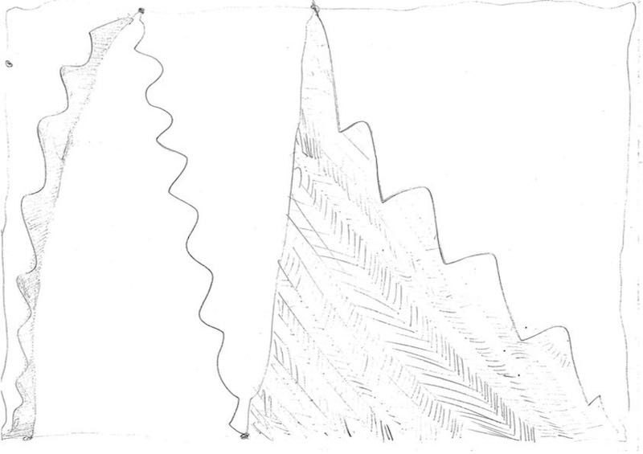
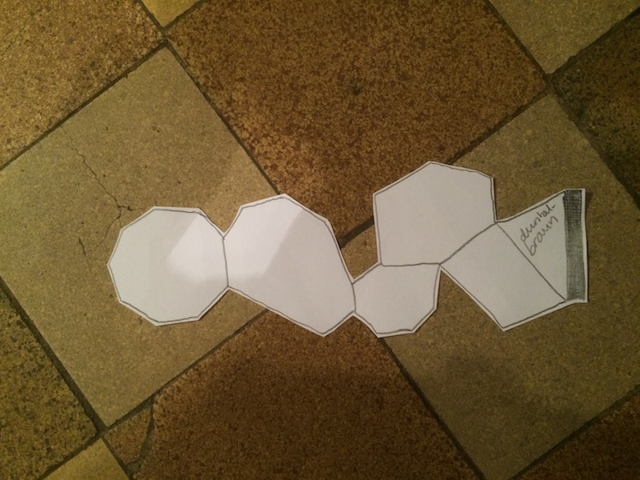

## Repo for analogue algorithm project within course “Eingabe/Ausgabe — Fundamentals of process oriented design” FHP - University of Applied Sciences Potsdam. Algorithmic Instructions kept in original language for accuracy.

## Analogue Algorithm:

Just as Sol LeWitt, we all asked people to draw for us. Goal of this adventure was at first sight, to get people to do “mathematical” reproduced individual art.
At first, everyone in the course wrote instructions for everyone else in the course, so that after everyone drew everyone else’s algorithm, we got an idea of how different this task could be interpreted.

## My instructions were:

- Zeichne Punkte, die jeweils mindestens 1cm voneinander entfernt sind, aber vom vorher gezeichneten Punkt maximal 5cm entfernt sind. Stoppe erst, wenn dies nicht mehr möglich ist.

# Results:

At latest at the second try, we found out that it’s all about giving the right directions. The goal should not be to get people to draw exactly the reproduced version of what you intended it to be, but rather “something  whatsoever without breaking the rules”

## First algorithm:

1. Ziehe einen geschlossenen Rahmen am gesamten Rand des Blattes entlang, wenige mm vom Außenrand des Blattes entfernt.
2. Markiere dir am rechten und linken Rand des Rahmens 2 beliebige Punkte, die nicht Eckpunkte des Rahmens sind.
3. Die jeweils oberen und unteren beiden verbindest du mit jeweils einer geraden Linie.
4. Nun hast du 3 viereckige Rahmen definiert. Ziehe durch jedes der Vierecke eine Zickzacklinie von einer beliebigen Ecke zu einer anderen, Mit jedem Zickzack die Kante berührend, mit beliebig vielen Zacken, so dass Dreiecke entstehen. Achte dabei darauf, dass du die Zickzacklinie nur so eng setzt, dass du noch Flächen zwischen den Strichen erkennen kannst.
5. Fülle das flächenmäßig kleinste aller Dreiecke komplett mit dem Bleistift aus.
6. Schraffiere das flächenmäßig größte Dreieck.
7. Zeichne in die Mitte alle Dreiecke, die mit einer Kante an eben schraffiertes Dreieck anschließen, einen fetten Punkt.

# Results:

The feeling I had after letting actual people do this algorithm, was that, (depending on his character) the drawer will most likely try to find a way to individualize and sabotage your rules. For example, one person drew the “closed frame” with rounded corners, so that there are no corner-edge points.
After that, including parameters, I changed my second algorithm to the following:

1. Arbeitsfläche: A4, einmal längs gefaltet, quer liegend.
2. Rechshänder: am linken Rand beginnen.
Linkshänder: am rechten Rand beginnen.
3. Zeichne am eben festgelegten Rand eine fette vertikale Linie beliebiger Länge.
4. Zeichne ein beliebig großes Dreieck indem du 2 weitere Linien an die eben gezeichnete ansetzt.
5. Setze an eben gezeichnetem Vieleck an einer beliebigen freien Kante ein weiteres Vieleck an, welches eine Ecke mehr hat als das vorherige.
6. Wiederhole Schritt 5 bis du ein Vieleck hast, was so viele Ecken hat, wie die Uhr gerade Stunden anzeigt (12-Stunden-Format).
7. Schreibe die Farbe deiner Haare in das Vieleck, welches in seiner Anzahl der Ecken am nächsten daran kommt, wie viele Biere du heute schon getrunken hast.
8. Schneide die Form im Gesamten aus, wähle einen Hintergrund deiner Wahl und fotografiere es.

# Results:

The next step was to convert the instructions for humans into something a computer could paint me.
Obviously, my parameters like drinking habits and hair color wouldn’t work with a machine, so i set some variables to random. The result was something completely senseless but beautiful to look at.
to integrate a parameter, i chose the time. my triangles would serve as the finger of the clock that shows the seconds, so if you start the code, it instantly draws as many triangles connected with each other as seconds are elapsed since the last full minute and continues to count them up until the next minute is reached.

# Results:

## License:

# The MIT License (MIT)

# Copyright (c) 2015 Christian Pflug

Permission is hereby granted, free of charge, to any person obtaining a copy
of this software and associated documentation files (the "Software"), to deal
in the Software without restriction, including without limitation the rights
to use, copy, modify, merge, publish, distribute, sublicense, and/or sell
copies of the Software, and to permit persons to whom the Software is
furnished to do so, subject to the following conditions:

The above copyright notice and this permission notice shall be included in all
copies or substantial portions of the Software.

THE SOFTWARE IS PROVIDED "AS IS", WITHOUT WARRANTY OF ANY KIND, EXPRESS OR
IMPLIED, INCLUDING BUT NOT LIMITED TO THE WARRANTIES OF MERCHANTABILITY,
FITNESS FOR A PARTICULAR PURPOSE AND NONINFRINGEMENT. IN NO EVENT SHALL THE
AUTHORS OR COPYRIGHT HOLDERS BE LIABLE FOR ANY CLAIM, DAMAGES OR OTHER
LIABILITY, WHETHER IN AN ACTION OF CONTRACT, TORT OR OTHERWISE, ARISING FROM,
OUT OF OR IN CONNECTION WITH THE SOFTWARE OR THE USE OR OTHER DEALINGS IN THE
SOFTWARE.
